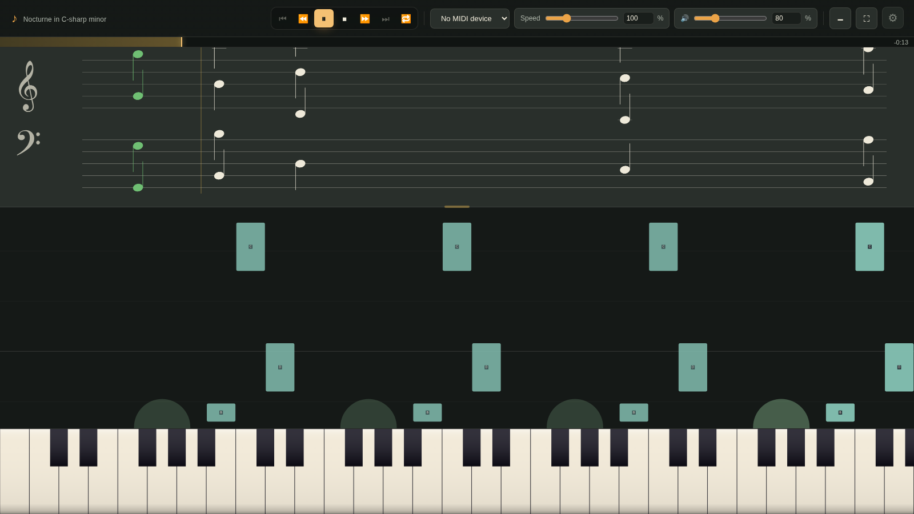
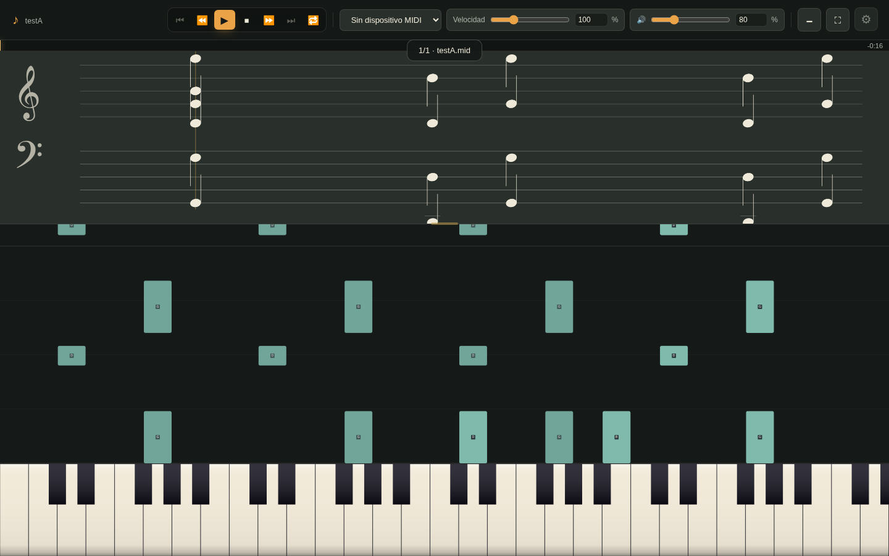
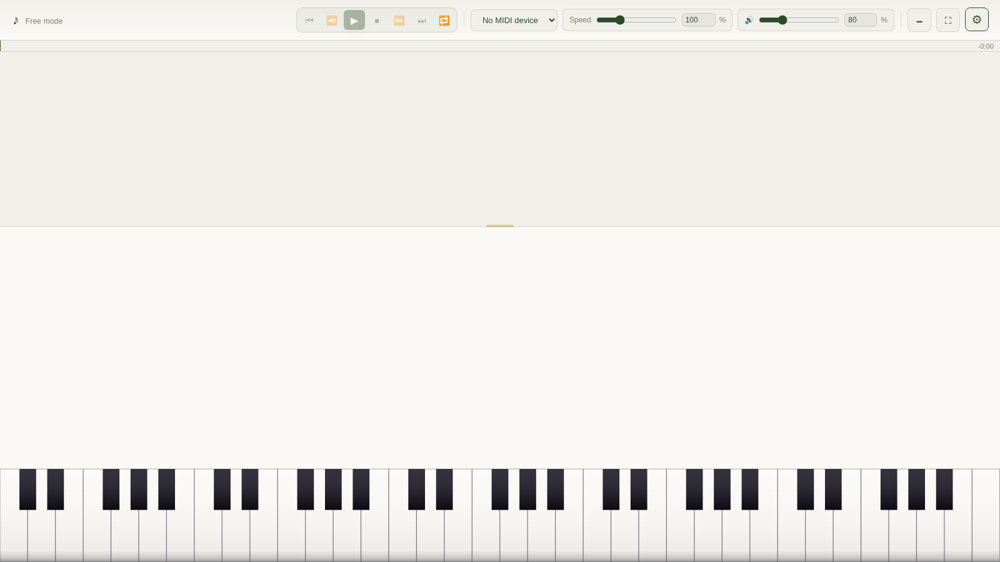
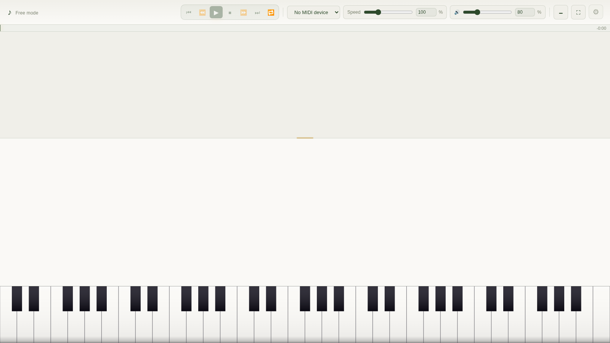
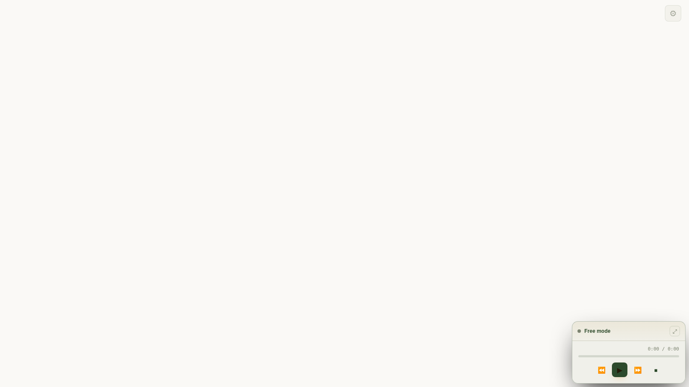

# MidiMate

> **A piano that lives in a single file.** Practice, watch, and play MIDI right in your browser — no build step, no install, no server.



MidiMate is a standalone web piano. Open `index.html` in any modern browser and you have a full practice studio: an on-screen keyboard you can play with mouse, touch, or a real MIDI device; falling notes and a real musical staff; MIDI file playback with per-track instruments; and a synth that can fall back to **real sampled instruments** when you want them.

It is a single HTML file (~200 KB, zero dependencies, zero build). Drop it on any static host, a USB stick, or open it straight from disk.

---

## Features

**Play**
- On-screen keyboard — mouse, **multi-touch** (each finger plays a note), computer keyboard, or a physical MIDI device (Web MIDI).
- Free play, with chord detection and note names (English `C D E`, Latin `Do Re Mi`, or German `C D E H`).
- Sustain pedal, velocity, and 30+ instrument presets.

**Learn & Watch**
- Load `.mid` / `.midi` files — multiple at once, queued into a **playlist** (⏮ / ⏭).
- Falling-notes roll synced to a real grand staff.
- Three modes: **Free** (play), **View** (auto-plays every track), **Practice** (waits for you, scores your accuracy).
- Per-track instrument, auto-play, mute, and visibility controls.

**Sound**
- Synthesized instruments (fast, offline) **or real sampled instruments** (FluidR3 soundfont) with **automatic preloading** of every note the song uses — so the first note already sounds real, with no synthetic-to-sample jump.
- 3-band EQ, master compression + limiting, bass control.

**Look & feel**
- **4 built-in themes**: *Electric Piano* and *Warm Night* (dark), *Golden Hour* and *Forest Canopy* (light).
- Key skins, tile skins, touch effects (flash, sparks, smoke, fire, bubbles, lightning).
- Up to 3 background layers (image / GIF / video) with free move and zoom.
- **Mini-player** (PiP) — shrink the app to a small floating window and keep playing while you work; optionally pause when minimized.

---

## Screenshots

| MIDI playback (dark) | Light theme |
|---|---|
|  |  |

| Free play | Mini-player |
|---|---|
|  |  |

---

## Getting started

**Option A — just open it**

Download `index.html` and open it in your browser (double-click). That's it.

**Option B — run a local server** (recommended; enables Service Worker / offline in future versions)

```bash
python3 -m http.server 8000
# then open http://localhost:8000
```

**MIDI device:** connect your keyboard and grant browser access when prompted. In Chrome/Brave you may need to enable Web MIDI for the page.

---

## Keyboard shortcuts

| Key | Action |
|---|---|
| `Space` | Play / Pause |
| `←` / `→` | Seek ∓ 5 s |
| `M` | Mute |
| `L` | Fullscreen |
| `N` | Toggle mini-player |
| `P` | Sustain pedal (hold) |
| `A W S E D F T G Y H U J K` | Play the notes (remappable in settings) |

All shortcuts are remappable in **Settings → Button assignment**.

---

## How it works

MidiMate is deliberately a **single self-contained `index.html`** — HTML, CSS and JavaScript in one file, no framework, no bundler, no build pipeline.

- **MIDI parsing** — a from-scratch SMF parser reads the byte stream into timed notes.
- **Audio** — the Web Audio API. Synthesized voices are built from oscillators and noise; the "realistic" mode fetches FluidR3 soundfont samples, **normalizes each sample** to a consistent peak, and caches them, so chords stay even and never clip.
- **Rendering** — everything (falling notes, staff, keyboard, effects) is drawn on `<canvas>`.
- **State** — all settings persist in `localStorage`.

---

## Roadmap / known limitations

- Runs as a local file today. A future version may add a **Service Worker** for true offline caching and a PWA install (requires serving over HTTP).
- Video export is planned.
- Only tested on Chromium-based browsers (Brave/Chrome). Firefox/Safari may have quirks with Web MIDI.

---

## License

**MIT with a Non-Commercial restriction.** See [LICENSE](./LICENSE).
You may use, modify, and share this software for **non-commercial** purposes only. Commercial use requires explicit written permission from the copyright holder.

---

## Credits

- Soundfont samples: [FluidR3_GM](https://gleitz.github.io/midi-js-soundfonts/) by gleitz (MIT).
- Built by [Zabat-code](https://github.com/Zabat-code).
